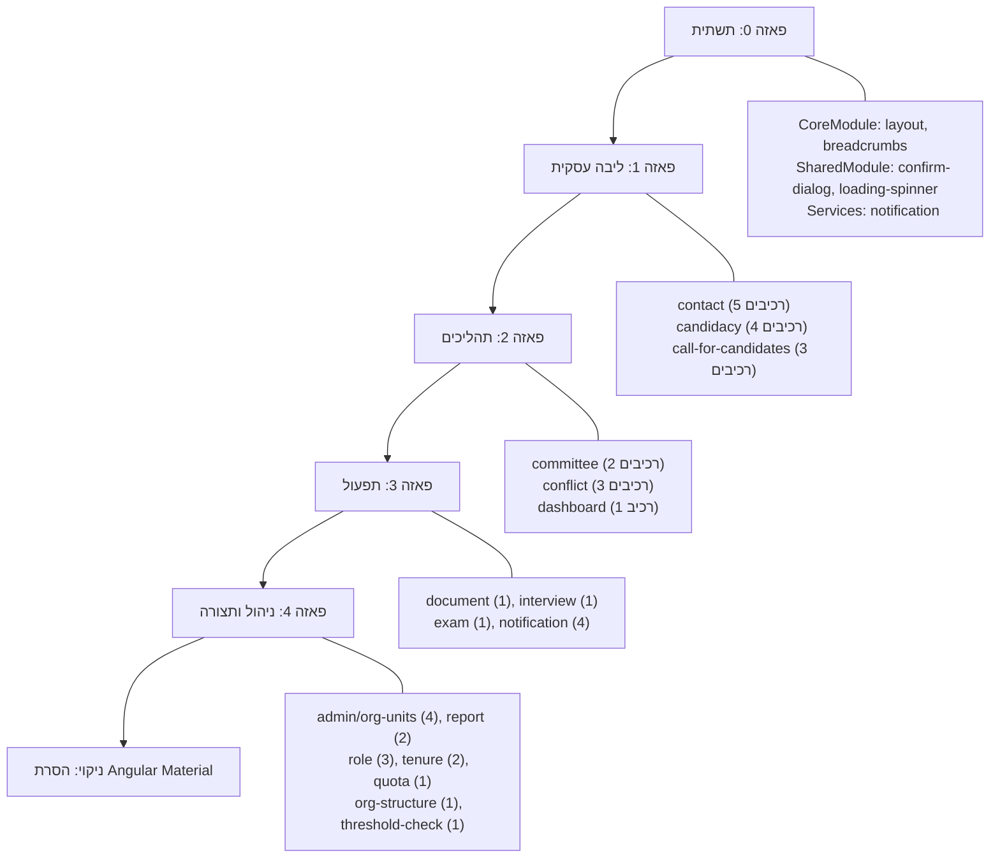
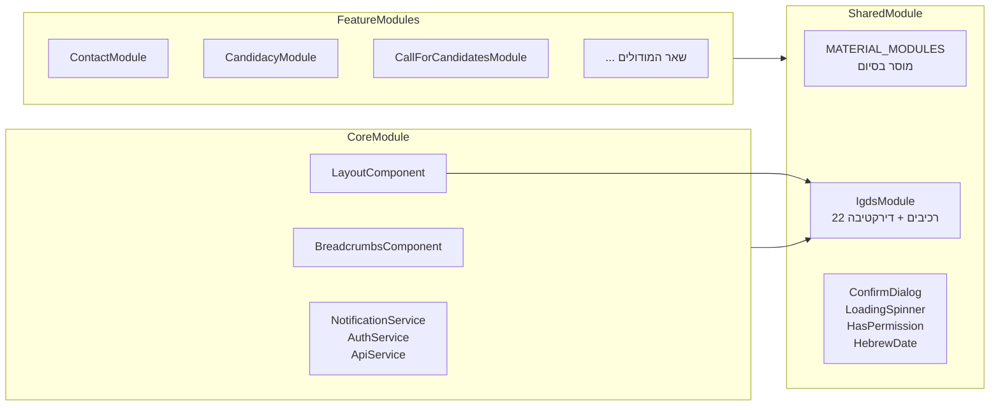

# מסמך עיצוב — מיגרציה מ-Angular Material ל-IGDS

## סקירה כללית

מסמך זה מתאר את העיצוב הטכני למיגרציה מלאה של ממשק המשתמש במערכת ניהול מועמדויות מרכיבי Angular Material לרכיבי IGDS (מערכת העיצוב הממשלתית הישראלית). המיגרציה היא frontend-only — ללא שינויים בצד השרת.

ספריית IGDS כבר קיימת ב-`client/src/app/shared/igds/` עם 22 רכיבים ודירקטיבה אחת, רשומים ב-`IgdsModule` ומיוצאים דרך `SharedModule`. ה-Design Tokens מוגדרים ב-`igds-tokens.scss` ומיובאים גלובלית.

המיגרציה מתבצעת ב-5 פאזות עצמאיות, כאשר בכל פאזה המערכת נשארת פעילה ופריסה עצמאית אפשרית. במהלך המיגרציה, `SharedModule` מייצא הן את מודולי Angular Material והן את `IgdsModule` במקביל, עד להסרה מלאה בסיום.

### החלטות עיצוב מרכזיות

1. **מיגרציה רכיב-רכיב**: כל רכיב Angular Material מוחלף ברכיב IGDS מקביל ישירות בתבנית (template) של הרכיב. אין שכבת abstraction ביניים.
2. **שימור ControlValueAccessor**: רכיבי טופס IGDS כבר מממשים `ControlValueAccessor`, כך ש-Reactive Forms ממשיכים לעבוד ללא שינוי בלוגיקה.
3. **החלפת MatTableDataSource**: במקום `MatTableDataSource`, הלוגיקה של סינון/מיון/עימוד מנוהלת ברכיב עצמו (או בשירות) ומועברת כ-`data` ל-`igds-table`.
4. **החלפת MatDialog בגישת template-driven**: במקום `MatDialog.open()` (imperative), `igds-modal` משתמש ב-`[visible]` binding (declarative). נדרש שירות עזר (`IgdsModalService`) לתמיכה בפתיחה פרוגרמטית עם החזרת ערך.
5. **החלפת MatSnackBar**: `NotificationService` יעבור לשימוש ב-`igds-toast` באמצעות שירות עזר (`IgdsToastService`) שמנהל מופע toast גלובלי.

## ארכיטקטורה

### תרשים פאזות המיגרציה



### תרשים ארכיטקטורת מודולים



### אסטרטגיית מיגרציה לכל רכיב

תהליך המיגרציה לכל רכיב Angular Material:

1. **זיהוי**: מיפוי כל שימושי Material בתבנית ובקוד TypeScript
2. **החלפת תבנית**: החלפת תגיות Material בתגיות IGDS מקבילות
3. **התאמת Inputs/Outputs**: מיפוי מאפיינים (variant, disabled, options וכו')
4. **הסרת ייבואים**: הסרת ייבואי Material מקובץ ה-TypeScript
5. **התאמת סגנונות**: החלפת CSS classes של Material ב-Design Tokens
6. **בדיקה**: וידוא פונקציונליות, RTL, נגישות

## רכיבים וממשקים

### טבלת מיפוי רכיבים

| Angular Material | IGDS | הערות |
|---|---|---|
| `mat-button` | `igds-button variant="secondary"` | |
| `mat-raised-button color="primary"` | `igds-button variant="primary"` | |
| `mat-icon-button` | `igds-button iconOnly=true` | |
| `mat-form-field` + `mat-input` | `igds-input-field` | CVA מובנה |
| `mat-select` | `igds-dropdown` | CVA מובנה, `IgdsDropdownOption[]` |
| `mat-datepicker` | `igds-date-picker` | CVA מובנה |
| `mat-checkbox` | `igds-checkbox` | CVA מובנה |
| `mat-radio-group` | `igds-radio-button` | CVA מובנה |
| `mat-slide-toggle` | `igds-toggle` | CVA מובנה |
| `mat-table` + `mat-sort` | `igds-table` | `IgdsTableColumn[]`, sort event |
| `mat-paginator` | `igds-pagination` | `totalItems`, `pageSize`, `pageChange` |
| `mat-card` | `igds-card` | content projection: header, body, footer |
| `mat-tab-group` | `igds-tabs` | `IgdsTab[]`, `tabChange` |
| `mat-accordion` | `igds-accordion` | |
| `MatDialog` | `igds-modal` + `IgdsModalService` | declarative + service wrapper |
| `MatSnackBar` | `igds-toast` + `IgdsToastService` | service wrapper |
| `matTooltip` | `igds-tooltip` directive | |
| `mat-chip` | `igds-tag` | |
| `mat-progress-bar` | `igds-progress-bar` | |
| `mat-progress-spinner` | `igds-progress-bar` / custom spinner | |
| `mat-toolbar` + `mat-sidenav` | `igds-side-menu` + custom header | |
| `mat-menu` | `igds-dropdown` / `igds-drawer` | |
| status icons | `igds-status-badge` | |
| `mat-stepper` (if used) | `igds-step-indicator` | |


### שירותי עזר חדשים

#### IgdsModalService

שירות wrapper שמאפשר פתיחה פרוגרמטית של `igds-modal` עם החזרת ערך, בדומה ל-`MatDialog.open()`:

```typescript
@Injectable({ providedIn: 'root' })
export class IgdsModalService {
  // פותח מודאל ומחזיר Observable<T> עם התוצאה
  open<T>(config: IgdsModalConfig): IgdsModalRef<T>;
}

interface IgdsModalConfig {
  title: string;
  component?: Type<any>;  // רכיב דינמי לתוכן
  template?: TemplateRef<any>;
  data?: any;
}

interface IgdsModalRef<T> {
  afterClosed(): Observable<T | undefined>;
  close(result?: T): void;
}
```

**הנמקה**: `igds-modal` הוא declarative (template-driven), אבל הקוד הקיים משתמש ב-`MatDialog.open()` באופן imperative. השירות מגשר על הפער הזה באמצעות `ComponentFactoryResolver` / `ViewContainerRef` ליצירת מודאל דינמי.

#### IgdsToastService

שירות wrapper שמחליף את `MatSnackBar`:

```typescript
@Injectable({ providedIn: 'root' })
export class IgdsToastService {
  success(message: string, duration?: number): void;
  error(message: string, duration?: number): void;
  warning(message: string, duration?: number): void;
  info(message: string, duration?: number): void;
}
```

**הנמקה**: `igds-toast` הוא רכיב declarative, אבל `NotificationService` קורא ל-`MatSnackBar.open()` באופן imperative. השירות מנהל מופע toast גלובלי (באמצעות `ApplicationRef` ו-dynamic component creation) ומספק API זהה.

### דפוס מיגרציית טבלאות

הדפוס החוזר ביותר במיגרציה הוא החלפת `mat-table` + `MatTableDataSource` + `mat-paginator` + `mat-sort`:

**לפני (Angular Material):**
```typescript
dataSource = new MatTableDataSource<T>();
@ViewChild(MatPaginator) paginator!: MatPaginator;
@ViewChild(MatSort) sort!: MatSort;

ngAfterViewInit() {
  this.dataSource.paginator = this.paginator;
  this.dataSource.sort = this.sort;
}
```

**אחרי (IGDS):**
```typescript
data: T[] = [];
columns: IgdsTableColumn[] = [...];
currentPage = 1;
pageSize = 10;
totalItems = 0;
sortColumn = '';
sortDirection: 'asc' | 'desc' = 'asc';

onSort(event: { column: string; direction: 'asc' | 'desc' }) {
  this.sortColumn = event.column;
  this.sortDirection = event.direction;
  this.loadData();
}

onPageChange(page: number) {
  this.currentPage = page;
  this.loadData();
}
```

**הנמקה**: `MatTableDataSource` מספק סינון/מיון/עימוד client-side מובנה. ב-IGDS, הלוגיקה הזו מנוהלת ברכיב עצמו או בשירות, מה שנותן שליטה מלאה ומאפשר גם server-side pagination.

### דפוס מיגרציית טפסים

**לפני:**
```html
<mat-form-field>
  <mat-label>שם פרטי</mat-label>
  <input matInput formControlName="firstName" />
  <mat-error *ngIf="form.get('firstName')?.hasError('required')">שדה חובה</mat-error>
</mat-form-field>
```

**אחרי:**
```html
<igds-input-field
  label="שם פרטי"
  formControlName="firstName"
  [required]="true"
  [error]="form.get('firstName')?.hasError('required') ? 'שדה חובה' : ''">
</igds-input-field>
```

**הנמקה**: `igds-input-field` מממש `ControlValueAccessor` ולכן `formControlName` עובד ישירות. הודעות שגיאה מועברות כ-`[error]` string במקום `<mat-error>` כרכיב ילד.

### דפוס מיגרציית דיאלוגים

**לפני:**
```typescript
const dialogRef = this.dialog.open(ConfirmDialogComponent, {
  data: { title: 'מחיקה', message: 'האם למחוק?' }
});
dialogRef.afterClosed().subscribe(confirmed => { ... });
```

**אחרי (עם IgdsModalService):**
```typescript
const modalRef = this.modalService.open<boolean>({
  title: 'מחיקה',
  component: IgdsConfirmDialogComponent,
  data: { message: 'האם למחוק?' }
});
modalRef.afterClosed().subscribe(confirmed => { ... });
```

### דפוס מיגרציית Layout

**לפני:**
```html
<mat-toolbar>...</mat-toolbar>
<mat-sidenav-container>
  <mat-sidenav position="end">
    <mat-nav-list>...</mat-nav-list>
  </mat-sidenav>
  <mat-sidenav-content>...</mat-sidenav-content>
</mat-sidenav-container>
```

**אחרי:**
```html
<header class="igds-header">...</header>
<div class="igds-layout">
  <igds-side-menu [items]="menuItems" (itemClick)="onMenuItemClick($event)"></igds-side-menu>
  <main class="igds-layout__content">
    <igds-breadcrumbs [items]="breadcrumbs"></igds-breadcrumbs>
    <div class="igds-layout__page"><ng-content></ng-content></div>
  </main>
</div>
```

## מודלי נתונים

### ממשקים קיימים שנשמרים ללא שינוי

הממשקים הבאים לא משתנים כי הם מייצגים נתונים עסקיים (לא UI):

- `Contact`, `Candidacy`, `CallForCandidates`, `Committee`, `Document` וכו'
- `UserProfile`, `NavItem`, `Breadcrumb`
- `ConfirmDialogData` — נשמר כממשק, רק המימוש משתנה

### ממשקי IGDS קיימים (כבר מוגדרים בספרייה)

```typescript
// igds-table
interface IgdsTableColumn {
  key: string;
  label: string;
  sortable?: boolean;
}

// igds-dropdown
interface IgdsDropdownOption {
  value: any;
  label: string;
}

// igds-side-menu
interface IgdsSideMenuItem {
  label: string;
  icon?: string;
  route?: string;
  children?: IgdsSideMenuItem[];
}

// igds-tabs
interface IgdsTab {
  label: string;
  id: string;
}
```

### ממשקים חדשים

```typescript
// שירות מודאל
interface IgdsModalConfig {
  title: string;
  component?: Type<any>;
  template?: TemplateRef<any>;
  data?: any;
  closable?: boolean;
}

interface IgdsModalRef<T = any> {
  afterClosed(): Observable<T | undefined>;
  close(result?: T): void;
}

// מיפוי NavItem ל-IgdsSideMenuItem
// NavItem הקיים ממופה ל-IgdsSideMenuItem:
// NavItem.label → IgdsSideMenuItem.label
// NavItem.icon → IgdsSideMenuItem.icon
// NavItem.route → IgdsSideMenuItem.route
```

### מיפוי MatTableDataSource → ניהול נתונים ידני

כל רכיב שמשתמש ב-`MatTableDataSource` יעבור לניהול נתונים ישיר:

| MatTableDataSource | IGDS |
|---|---|
| `dataSource.data = [...]` | `this.data = [...]` (Input ל-igds-table) |
| `dataSource.paginator` | `igds-pagination` עם `(pageChange)` |
| `dataSource.sort` | `igds-table` עם `(sort)` event |
| `dataSource.filter` | לוגיקת סינון ברכיב / בשירות |


## תכונות נכונות (Correctness Properties)

*תכונה (property) היא מאפיין או התנהגות שצריכים להתקיים בכל הרצה תקינה של המערכת — למעשה, הצהרה פורמלית על מה שהמערכת אמורה לעשות. תכונות משמשות כגשר בין מפרטים קריאים לאדם לבין ערבויות נכונות שניתנות לאימות אוטומטי.*

### Property 1: אין שרידי Angular Material בתבניות שהומרו

*For any* migrated component template (HTML), no Angular Material selectors or directives should appear. Specifically, the template should not contain any of: `mat-button`, `mat-raised-button`, `mat-icon-button`, `mat-form-field`, `matInput`, `mat-select`, `mat-datepicker`, `mat-checkbox`, `mat-radio`, `mat-slide-toggle`, `mat-table`, `mat-sort`, `mat-paginator`, `mat-card`, `mat-tab`, `mat-accordion`, `mat-expansion-panel`, `MatDialog`, `matTooltip`, `mat-chip`, `mat-progress-bar`, `mat-progress-spinner`, `mat-toolbar`, `mat-sidenav`, `mat-menu`, `mat-nav-list`.

**Validates: Requirements 4.1, 4.2, 4.3, 5.1, 5.2, 5.3, 5.4, 5.5, 5.6, 6.1, 6.3, 7.1, 7.3, 7.4, 8.1, 8.2, 8.3, 9.1, 9.2**

### Property 2: שלמות ControlValueAccessor (round-trip)

*For any* IGDS form component (igds-input-field, igds-dropdown, igds-date-picker, igds-checkbox, igds-radio-button, igds-toggle), writing a value via `writeValue(v)` and then reading the component's internal value should return `v`. Additionally, for any user input event, the registered `onChange` callback should be invoked with the new value.

**Validates: Requirements 5.7**

### Property 3: שימור הודעות שגיאה וולידציה בטפסים

*For any* form component with a non-empty `error` string input, the rendered output should display that exact error string in a visible element with `role="alert"`. For any form with Angular Validators, the migrated IGDS form should trigger the same validation errors for the same invalid inputs.

**Validates: Requirements 5.8, 17.2**

### Property 4: שלמות פונקציונליות טבלאות

*For any* dataset and set of `IgdsTableColumn` definitions, the `igds-table` should: (a) render header cells matching each column's `label`, (b) for any sortable column, clicking the header should emit a sort event with the correct column key and toggled direction, (c) combined with `igds-pagination`, changing page should display the correct slice of data.

**Validates: Requirements 6.2, 6.4, 17.3, 17.6**

### Property 5: חישוב עימוד נכון

*For any* positive `totalItems` and `pageSize` from {10, 25, 50}, `igds-pagination` should calculate `totalPages = ceil(totalItems / pageSize)`, and for any page number `p` where `1 ≤ p ≤ totalPages`, navigating to page `p` should emit `pageChange` with value `p`. Navigation to pages outside this range should be prevented.

**Validates: Requirements 6.6**

### Property 6: זרימת נתונים בדיאלוגים (round-trip)

*For any* modal opened via `IgdsModalService.open()` with input data, and closed with a result value `R`, the `afterClosed()` Observable should emit exactly `R`. If the modal is dismissed without a result, `afterClosed()` should emit `undefined`.

**Validates: Requirements 8.4, 17.4**

### Property 7: סוגי הודעות toast

*For any* notification type in {success, error, warning, info}, calling the corresponding method on `IgdsToastService` should render an `igds-toast` with the matching `type` variant and the provided message text.

**Validates: Requirements 8.5**

### Property 8: מיפוי סטטוס מועמדות ל-status-badge

*For any* candidacy status value, the migrated component should render an `igds-status-badge` with the correct `variant` (success/warning/failure/info/neutral) corresponding to that status.

**Validates: Requirements 9.3**

### Property 9: תמיכה ב-RTL ו-CSS logical properties

*For any* migrated component's stylesheet, (a) `direction` should be set to `inherit` (not `ltr` or `rtl` explicitly), and (b) no physical direction CSS properties (`margin-left`, `margin-right`, `padding-left`, `padding-right`, `left`, `right`, `text-align: left/right`) should appear — only logical equivalents (`margin-inline-start`, `margin-inline-end`, `padding-inline-start`, `padding-inline-end`, `inset-inline-start`, `text-align: start/end`).

**Validates: Requirements 10.1, 10.2**

### Property 10: שימוש בלעדי ב-Design Tokens

*For any* migrated component's stylesheet, no hardcoded color values (hex `#xxx`, `rgb()`, `rgba()` except in token definitions), hardcoded font-family strings, or hardcoded spacing pixel values should appear. All such values should reference IGDS CSS custom properties (`var(--igds-*)`).

**Validates: Requirements 10.3, 10.5**

### Property 11: תכונות ARIA ברכיבים אינטראקטיביים

*For any* interactive IGDS component (buttons, inputs, dropdowns, modals, tables, tabs), the rendered HTML should include appropriate ARIA attributes: `role` where semantic HTML is insufficient, `aria-label` or `aria-labelledby` for non-text elements, `aria-expanded` for expandable elements, `aria-selected` for selectable items, and `aria-invalid`/`aria-describedby` for form elements with errors.

**Validates: Requirements 11.2, 11.5**

### Property 12: גודל מינימלי למגע ו-focus-visible

*For any* interactive element in IGDS components (buttons, inputs, dropdown triggers, pagination buttons, tab buttons), the computed `min-height` should be at least 44px. Additionally, the component's stylesheet should include a `:focus-visible` rule that uses `--igds-border-focused`.

**Validates: Requirements 11.3, 11.4**

### Property 13: סינון ניווט לפי הרשאות

*For any* user with a set of permissions, the filtered navigation items should include exactly: (a) all items without a `permission` requirement, plus (b) all items whose `permission` value is included in the user's permissions set. No items should be added or removed beyond this rule.

**Validates: Requirements 2.5, 17.5**

### Property 14: שמירה על ממשק ConfirmDialogData

*For any* valid `ConfirmDialogData` object (with `title`, `message`, and optional `confirmText`/`cancelText`), the migrated confirm dialog should render the `title` and `message` in the modal, and display buttons with the provided text (or defaults 'אישור'/'ביטול').

**Validates: Requirements 3.5**

### Property 15: שמירה על מאפייני כפתורים

*For any* button with `disabled`, `type`, and/or `aria-label` attributes, the migrated `igds-button` should preserve all these attributes with their original values.

**Validates: Requirements 4.4**

## טיפול בשגיאות

### שגיאות בזמן מיגרציה

| תרחיש | טיפול |
|---|---|
| רכיב IGDS חסר Input נדרש | הגדרת ערכי ברירת מחדל סבירים בכל רכיב IGDS |
| `IgdsModalService.open()` נכשל | catch ב-Observable, הצגת הודעת שגיאה ב-console, fallback ל-`window.confirm()` |
| `IgdsToastService` נכשל | catch, fallback ל-`console.warn()` |
| טופס עם validators לא תואמים | שמירה על אותם Validators — אין שינוי בלוגיקת הוולידציה |
| רכיב Material ו-IGDS מתנגשים בסגנונות | בידוד באמצעות `:host` encapsulation ו-IGDS class prefixes |

### שגיאות בזמן ריצה

- **טבלה ללא נתונים**: `igds-table` מציג הודעת "לא נמצאו תוצאות" (edge case מדרישה 6.5)
- **עימוד עם 0 פריטים**: `igds-pagination` מציג עמוד 1 ריק, כפתורי ניווט מושבתים
- **dropdown ללא אפשרויות**: `igds-dropdown` מציג placeholder, רשימה ריקה
- **toast ללא הודעה**: לא מוצג (guard ב-service)
- **modal ללא title**: מוצג ללא כותרת, כפתור סגירה עדיין פעיל

## אסטרטגיית בדיקות

### גישה כפולה: בדיקות יחידה + בדיקות מבוססות תכונות

המיגרציה נבדקת בשתי שכבות משלימות:

#### בדיקות יחידה (Unit Tests)

בדיקות יחידה מתמקדות בדוגמאות ספציפיות, edge cases ואינטגרציה:

- **דוגמאות ספציפיות**: כל רכיב שהומר נבדק עם נתונים קונקרטיים (למשל: contact-list עם 3 אנשי קשר)
- **Edge cases**: טבלה ריקה, טופס ללא validators, modal ללא title
- **אינטגרציה**: SharedModule מייצא נכון, CoreModule מכיל רכיבי IGDS
- **סיום מיגרציה**: אין ייבואי Material ב-SharedModule, CoreModule, package.json, angular.json, styles.scss, index.html (דרישות 12.1-12.6)
- **מיגרציית מודולים**: כל מודול בכל פאזה מכיל את כל הרכיבים הנדרשים (דרישות 13-16)

#### בדיקות מבוססות תכונות (Property-Based Tests)

ספריית PBT: **fast-check** (עבור TypeScript/Angular)

כל בדיקת תכונה מריצה מינימום 100 איטרציות עם קלטים אקראיים.

כל בדיקה מתויגת בפורמט:
`Feature: igds-ui-migration, Property {number}: {property_text}`

תכונות לבדיקה:

1. **Property 1 — אין שרידי Material**: מריצים על כל קובצי template שהומרו, בודקים שאין selectors של Material
2. **Property 2 — CVA round-trip**: מייצרים ערכים אקראיים (strings, numbers, dates, booleans), כותבים ל-CVA, קוראים בחזרה
3. **Property 3 — הודעות שגיאה**: מייצרים strings אקראיים כ-error, בודקים שמופיעים ב-DOM עם role="alert"
4. **Property 4 — טבלאות**: מייצרים מערכי נתונים ועמודות אקראיים, בודקים headers, sort events, pagination slicing
5. **Property 5 — עימוד**: מייצרים totalItems ו-pageSize אקראיים, בודקים חישוב totalPages וניווט
6. **Property 6 — דיאלוגים round-trip**: מייצרים data ו-result אקראיים, בודקים שה-Observable מחזיר את ה-result
7. **Property 7 — toast types**: מייצרים type ו-message אקראיים, בודקים variant ותוכן
8. **Property 8 — status badge mapping**: מייצרים סטטוסים אקראיים, בודקים variant נכון
9. **Property 9 — RTL/logical properties**: סורקים stylesheets של רכיבים שהומרו, בודקים direction: inherit ואין physical properties
10. **Property 10 — Design Tokens**: סורקים stylesheets, בודקים שאין hardcoded values
11. **Property 11 — ARIA**: מייצרים רכיבים עם מצבים אקראיים (open/closed, error/valid), בודקים ARIA attributes
12. **Property 12 — touch target + focus**: בודקים min-height ≥ 44px ו-focus-visible rule בכל רכיב אינטראקטיבי
13. **Property 13 — סינון ניווט**: מייצרים sets של permissions אקראיים, בודקים שהפילטר מחזיר את הפריטים הנכונים
14. **Property 14 — ConfirmDialogData**: מייצרים ConfirmDialogData אקראי, בודקים שכל השדות מוצגים
15. **Property 15 — מאפייני כפתורים**: מייצרים כפתורים עם שילובי disabled/type/aria-label אקראיים, בודקים שמירה

#### איזון בין בדיקות יחידה לבדיקות תכונות

- **בדיקות יחידה**: edge cases (טבלה ריקה, modal ללא title), בדיקות אינטגרציה (module exports), בדיקות סיום מיגרציה (הסרת Material)
- **בדיקות תכונות**: כל מה שמתאים לבדיקה עם קלטים אקראיים — CVA, טבלאות, עימוד, דיאלוגים, RTL, נגישות, ניווט
- יחד: כיסוי מקיף — בדיקות יחידה תופסות באגים קונקרטיים, בדיקות תכונות מוודאות נכונות כללית
