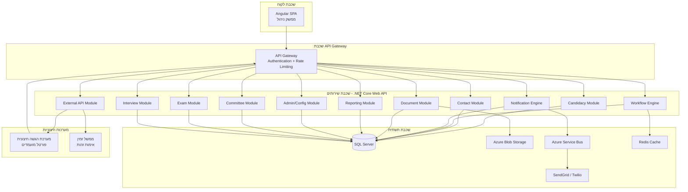
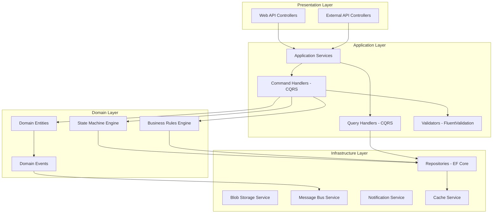
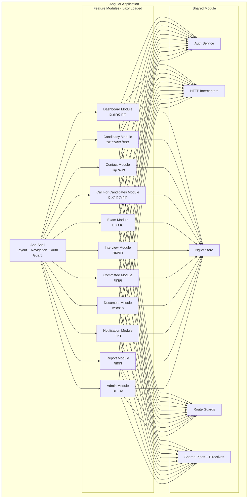
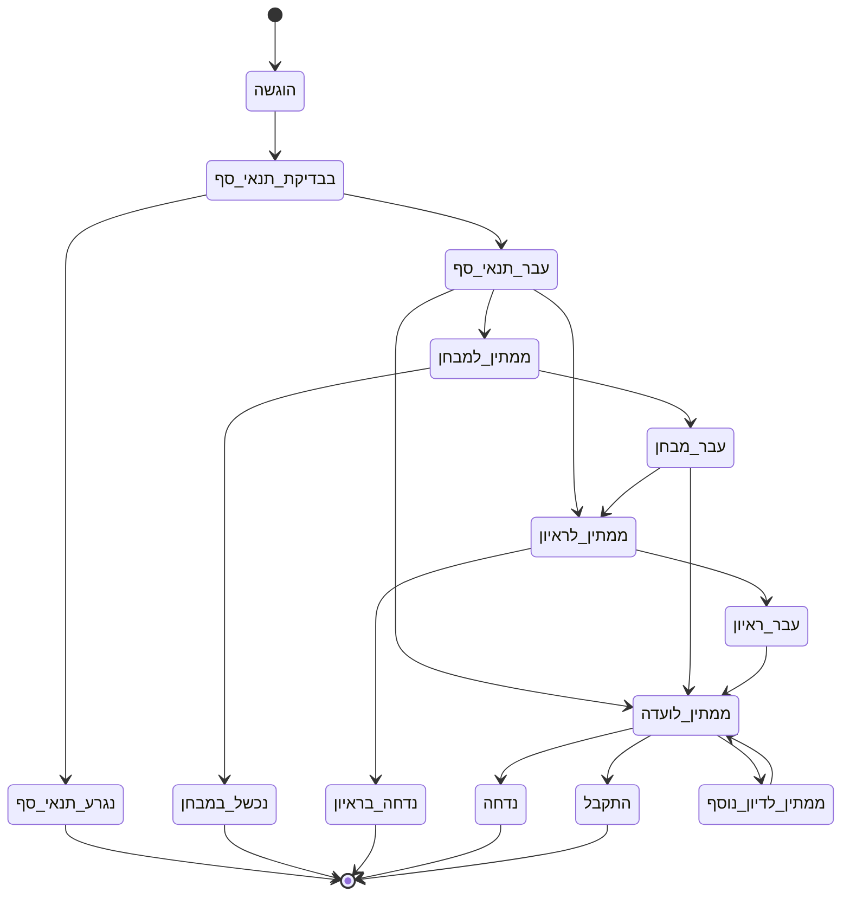
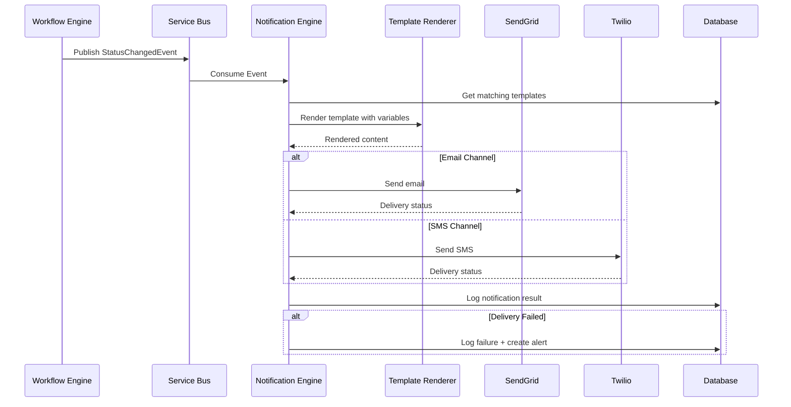
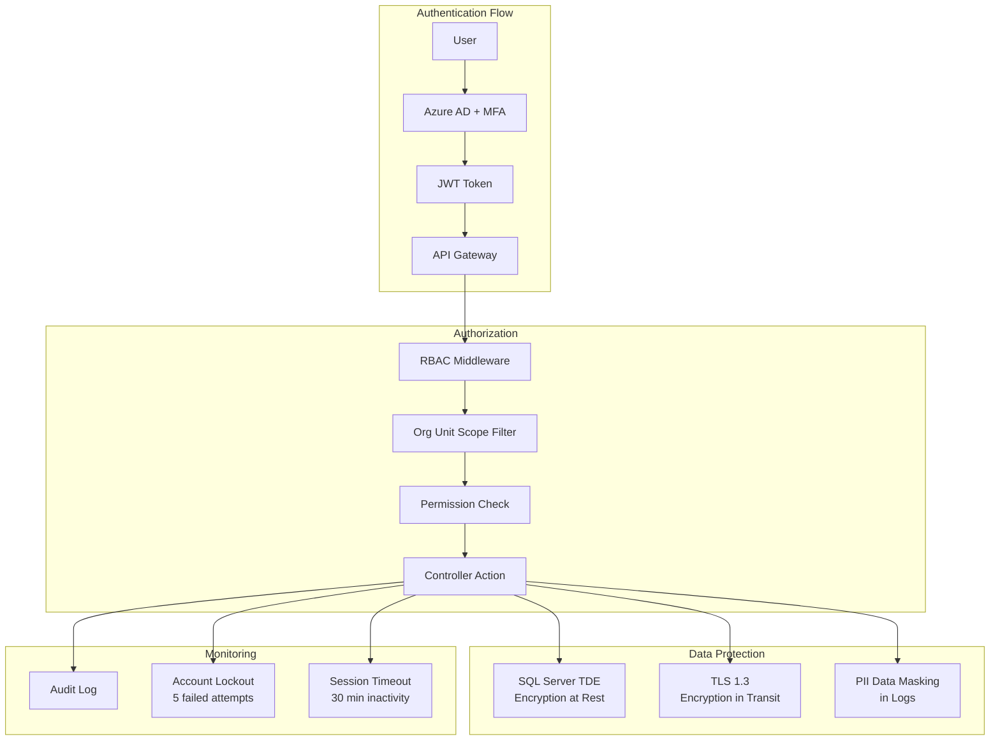

# מסמך עיצוב טכני - מערכת ניהול מועמדויות מאוחדת

## סקירה כללית

מסמך זה מתאר את העיצוב הטכני של מערכת ניהול מועמדויות מאוחדת עבור הנהלת בתי המשפט בישראל. המערכת מחליפה שלוש מערכות נפרדות (עוזמ"ת, נציגי ציבור, בית המשפט העליון) בפלטפורמה אחידה וגמישה.

### עקרונות עיצוב מרכזיים

- **ריבוי דיירים (Multi-Tenant)**: כל יחידה ארגונית פועלת כדייר עצמאי עם הגדרות ייחודיות
- **קונפיגורציה על פני קוד**: תהליכי מיון, סטטוסים, כללים עסקיים ושדות מותאמים מוגדרים בקונפיגורציה ולא בקוד
- **State Machine מוגדר**: מעברי סטטוס מנוהלים באמצעות מכונת מצבים הניתנת להגדרה לכל יחידה
- **הפרדת אחריות**: מערכת ההגשה החיצונית (פורטל מועמדים) מתקשרת דרך API בלבד
- **הרשאות מבוססות תפקיד**: RBAC עם היקף ברמת יחידה ארגונית
- **ביקורת מלאה**: תיעוד כל פעולה ושינוי במערכת

### מחסנית טכנולוגית

| שכבה | טכנולוגיה |
|---|---|
| Frontend | Angular 17+ עם Angular Material |
| Backend API | .NET Core 8 Web API |
| בסיס נתונים | SQL Server 2022 |
| אימות | Azure AD / IdentityServer עם MFA |
| אחסון קבצים | Azure Blob Storage |
| תורי הודעות | Azure Service Bus |
| Cache | Redis |
| דיוור | SendGrid (Email) + Twilio (SMS) |

## ארכיטקטורה

### תרשים ארכיטקטורה כללי



### ארכיטקטורת שכבות (Layered Architecture)

המערכת בנויה בארכיטקטורת Clean Architecture:



### דפוס CQRS

המערכת מיישמת דפוס CQRS (Command Query Responsibility Segregation) להפרדה בין פעולות כתיבה (Commands) לפעולות קריאה (Queries):

- **Commands**: יצירת מועמדות, עדכון סטטוס, העלאת מסמך, שליחת הודעה
- **Queries**: שליפת רשימת מועמדויות, דוחות, לוח מחוונים, חיפוש אנשי קשר

### החלטות עיצוב מרכזיות

| החלטה | נימוק |
|---|---|
| Clean Architecture | הפרדת שכבות מאפשרת בדיקות יחידה ושינויים עתידיים ללא השפעה על שכבות אחרות |
| CQRS | הפרדה בין קריאה לכתיבה מאפשרת אופטימיזציה נפרדת לדוחות ולפעולות עסקיות |
| State Machine מוגדר בDB | גמישות מלאה ליחידות ארגוניות להגדיר תהליכים ללא שינוי קוד |
| Azure Service Bus לדיוור | עיבוד אסינכרוני של הודעות מונע חסימת תהליכים עסקיים |
| EF Core + Raw SQL לדוחות | EF Core לפעולות CRUD, Dapper/Raw SQL לדוחות מורכבים |
| Tenant Isolation בDB | שימוש ב-OrganizationalUnitId כ-discriminator בכל טבלה רלוונטית |

## רכיבים וממשקים

### מודולי Backend (.NET Core)

#### 1. Admin/Config Module - מודול ניהול והגדרות
אחראי על הגדרת יחידות ארגוניות, תהליכי מיון, סטטוסים, כללים עסקיים ושדות מותאמים.

**ממשקים עיקריים:**
```csharp
public interface IOrganizationalUnitService
{
    Task<OrgUnitDto> CreateAsync(CreateOrgUnitCommand cmd);
    Task<OrgUnitDto> UpdateAsync(UpdateOrgUnitCommand cmd);
    Task<WorkflowDefinitionDto> ConfigureWorkflowAsync(ConfigureWorkflowCommand cmd);
    Task<IEnumerable<StatusDefinitionDto>> ConfigureStatusesAsync(ConfigureStatusesCommand cmd);
    Task<StateMachineDto> ConfigureTransitionsAsync(ConfigureTransitionsCommand cmd);
    Task ConfigureBusinessRulesAsync(ConfigureBusinessRulesCommand cmd);
    Task ConfigureCustomFieldsAsync(ConfigureCustomFieldsCommand cmd);
}
```

#### 2. Contact Module - מודול אנשי קשר
ניהול מאגר אנשי קשר מרכזי עם זיהוי ייחודי לפי תעודת זהות.

```csharp
public interface IContactService
{
    Task<ContactDto> CreateOrLinkAsync(CreateContactCommand cmd);
    Task<ContactDto> UpdateAsync(UpdateContactCommand cmd);
    Task<ContactDto> GetByIdNumberAsync(string idNumber);
    Task<IEnumerable<CandidacyDto>> GetCandidaciesAsync(int contactId, int? orgUnitId = null);
    Task<IEnumerable<ChangeHistoryDto>> GetChangeHistoryAsync(int contactId);
}
```

#### 3. Candidacy Module - מודול מועמדויות
ניהול מועמדויות כולל יצירה, עדכון סטטוס ומעקב.

```csharp
public interface ICandidacyService
{
    Task<CandidacyDto> CreateAsync(CreateCandidacyCommand cmd);
    Task<CandidacyDto> UpdateStatusAsync(UpdateStatusCommand cmd);
    Task<IEnumerable<CandidacyDto>> ListAsync(CandidacyQueryParams query);
    Task<CandidacyDetailDto> GetDetailAsync(int candidacyId);
    Task ValidateDuplicateAsync(int contactId, int callForCandidatesId);
}
```

#### 4. Workflow Engine - מנוע תהליכים
מנוע State Machine שמנהל מעברי סטטוס בהתאם להגדרות היחידה הארגונית.

```csharp
public interface IWorkflowEngine
{
    Task<bool> CanTransitionAsync(int candidacyId, string targetStatus);
    Task<StatusTransitionResult> ExecuteTransitionAsync(int candidacyId, string targetStatus, string reason);
    Task<IEnumerable<string>> GetAllowedTransitionsAsync(int candidacyId);
    Task<WorkflowDefinition> GetWorkflowDefinitionAsync(int orgUnitId);
}
```

#### 5. Business Rules Engine - מנוע כללים עסקיים
הפעלת כללים עסקיים מותנים (ציון סף, מניעת כפילויות, חישובי ציון).

```csharp
public interface IBusinessRulesEngine
{
    Task<RuleEvaluationResult> EvaluateAsync(BusinessRuleContext context);
    Task<IEnumerable<BusinessRuleDto>> GetRulesForOrgUnitAsync(int orgUnitId);
    Task<ThresholdCheckResult> CheckThresholdAsync(int candidacyId);
}
```

#### 6. Notification Engine - מנוע דיוור
שליחת הודעות אוטומטיות וידניות בדוא"ל ו-SMS.

```csharp
public interface INotificationEngine
{
    Task SendAsync(NotificationCommand cmd);
    Task SendBulkAsync(BulkNotificationCommand cmd);
    Task<IEnumerable<NotificationLogDto>> GetLogsAsync(int candidacyId);
    Task<NotificationTemplateDto> RenderTemplateAsync(int templateId, Dictionary<string, string> variables);
}
```

#### 7. External API Module - מודול API חיצוני
ממשק לקליטת מועמדויות ממערכת ההגשה החיצונית.

```csharp
public interface IExternalSubmissionService
{
    Task<SubmissionResult> SubmitCandidacyAsync(ExternalCandidacySubmission submission);
    Task<ValidationResult> ValidateSubmissionAsync(ExternalCandidacySubmission submission);
    Task<SubmissionStatusDto> GetSubmissionStatusAsync(string submissionId);
}
```

### מודולי Frontend (Angular)



**ניהול מצב (State Management):**
- שימוש ב-NgRx לניהול מצב גלובלי (משתמש נוכחי, יחידה ארגונית נבחרת, הגדרות)
- Component-level state לנתונים מקומיים (טפסים, טבלאות)
- Effects לטיפול בקריאות API אסינכרוניות

### ממשקי API עיקריים

#### API ניהול (Internal)

| Endpoint | Method | תיאור |
|---|---|---|
| `/api/org-units` | GET/POST | רשימת/יצירת יחידות ארגוניות |
| `/api/org-units/{id}/workflow` | GET/PUT | הגדרת תהליך מיון |
| `/api/org-units/{id}/statuses` | GET/PUT | הגדרת סטטוסים ומעברים |
| `/api/org-units/{id}/business-rules` | GET/PUT | הגדרת כללים עסקיים |
| `/api/org-units/{id}/custom-fields` | GET/PUT | הגדרת שדות מותאמים |
| `/api/contacts` | GET/POST | חיפוש/יצירת אנשי קשר |
| `/api/contacts/{id}` | GET/PUT | צפייה/עדכון איש קשר |
| `/api/contacts/{id}/candidacies` | GET | מועמדויות של איש קשר |
| `/api/contacts/{id}/history` | GET | היסטוריית שינויים |
| `/api/candidacies` | GET/POST | רשימת/יצירת מועמדויות |
| `/api/candidacies/{id}` | GET/PUT | צפייה/עדכון מועמדות |
| `/api/candidacies/{id}/status` | PUT | עדכון סטטוס מועמדות |
| `/api/candidacies/{id}/documents` | GET/POST | מסמכי מועמדות |
| `/api/candidacies/{id}/notifications` | GET | היסטוריית הודעות |
| `/api/calls-for-candidates` | GET/POST | קולות קוראים |
| `/api/calls-for-candidates/{id}` | GET/PUT | צפייה/עדכון קול קורא |
| `/api/exams` | GET/POST | מבחנים |
| `/api/exams/{id}/scores` | POST/PUT | הזנת/עדכון ציונים |
| `/api/exams/{id}/appeals` | POST | הגשת ערעור |
| `/api/interviews` | GET/POST | ראיונות |
| `/api/interviews/{id}/feedback` | POST | הזנת משוב |
| `/api/committees` | GET/POST | ועדות |
| `/api/committees/{id}/sessions` | GET/POST | ישיבות ועדה |
| `/api/committees/sessions/{id}/decisions` | POST | החלטות ועדה |
| `/api/notifications/templates` | GET/POST | תבניות דיוור |
| `/api/notifications/send` | POST | שליחת הודעה ידנית |
| `/api/reports/{type}` | GET | הפקת דוח |
| `/api/dashboard` | GET | נתוני לוח מחוונים |

#### API חיצוני (External Submission)

| Endpoint | Method | תיאור |
|---|---|---|
| `/api/external/v1/submissions` | POST | הגשת מועמדות חדשה |
| `/api/external/v1/submissions/{id}/status` | GET | בדיקת סטטוס הגשה |
| `/api/external/v1/submissions/{id}/documents` | POST | העלאת מסמכים |
| `/api/external/v1/calls-for-candidates` | GET | רשימת קולות קוראים פתוחים |
| `/api/external/v1/calls-for-candidates/{id}/requirements` | GET | דרישות קול קורא |

**אימות API חיצוני:**
- API Key בכותרת `X-API-Key` לזיהוי מערכת ההגשה
- OAuth 2.0 Client Credentials לאימות מתקדם
- Rate Limiting: 100 בקשות לדקה למערכת הגשה
- כל קריאה נרשמת ב-Audit Log


## מודלי נתונים

### תרשים ERD

```mermaid
erDiagram
    OrganizationalUnit ||--o{ WorkflowDefinition : "has"
    OrganizationalUnit ||--o{ StatusDefinition : "defines"
    OrganizationalUnit ||--o{ StatusTransition : "defines"
    OrganizationalUnit ||--o{ BusinessRule : "defines"
    OrganizationalUnit ||--o{ CustomFieldDefinition : "defines"
    OrganizationalUnit ||--o{ CallForCandidates : "publishes"
    OrganizationalUnit ||--o{ NotificationTemplate : "defines"
    OrganizationalUnit ||--o{ UserRole : "defines"
    OrganizationalUnit ||--o{ Committee : "has"
    OrganizationalUnit ||--o{ OrgSubUnit : "contains"
    OrganizationalUnit ||--o{ QuotaDefinition : "defines"

    Contact ||--o{ Candidacy : "submits"
    Contact ||--o{ ContactCustomFieldValue : "has"
    Contact ||--o{ ContactChangeHistory : "tracks"
    Contact ||--o{ Tenure : "serves"
    Contact ||--o{ ConflictOfInterest : "declares"
    Contact ||--o{ FamilyRelation : "declares"

    CallForCandidates ||--o{ Candidacy : "receives"
    CallForCandidates ||--o{ ThresholdCondition : "defines"
    CallForCandidates ||--o{ RequiredDocument : "requires"
    CallForCandidates ||--o{ Position : "offers"

    Candidacy ||--o{ CandidacyStatusHistory : "tracks"
    Candidacy ||--o{ CandidacyCustomFieldValue : "has"
    Candidacy ||--o{ Document : "attaches"
    Candidacy ||--o{ ExamScore : "receives"
    Candidacy ||--o{ InterviewFeedback : "receives"
    Candidacy ||--o{ CommitteeDecision : "receives"
    Candidacy ||--o{ NotificationLog : "receives"
    Candidacy ||--o{ ThresholdCheckResult : "evaluated"

    Exam ||--o{ ExamScore : "records"
    Interview ||--o{ InterviewFeedback : "records"
    Committee ||--o{ CommitteeSession : "holds"
    Committee ||--o{ CommitteeMember : "includes"
    CommitteeSession ||--o{ CommitteeDecision : "decides"

    UserRole ||--o{ UserRolePermission : "grants"
    User ||--o{ UserRoleAssignment : "assigned"

    OrganizationalUnit {
        int Id PK
        string Name
        string Description
        string ContactEmail
        string ContactPhone
        bool IsActive
        datetime CreatedAt
        datetime UpdatedAt
    }

    WorkflowDefinition {
        int Id PK
        int OrgUnitId FK
        string Name
        bool ExamStepEnabled
        bool InterviewStepEnabled
        bool CommitteeStepEnabled
        bool ThresholdCheckEnabled
        string StepOrder
        int Version
        bool IsActive
        datetime CreatedAt
    }

    StatusDefinition {
        int Id PK
        int OrgUnitId FK
        string Code
        string DisplayName
        string Category
        bool IsFinal
        bool IsInitial
        int SortOrder
    }

    SubStatusDefinition {
        int Id PK
        int StatusDefinitionId FK
        string Code
        string DisplayName
    }

    StatusTransition {
        int Id PK
        int OrgUnitId FK
        int FromStatusId FK
        int ToStatusId FK
        string RequiredPermission
        bool RequiresReason
        string AutoTriggerRule
    }

    BusinessRule {
        int Id PK
        int OrgUnitId FK
        string RuleType
        string Name
        string ConditionExpression
        string ActionType
        string ActionParameters
        bool IsActive
        int Priority
    }

    CustomFieldDefinition {
        int Id PK
        int OrgUnitId FK
        string EntityType
        string FieldName
        string FieldType
        bool IsRequired
        string ValidationRule
        string Options
        int SortOrder
    }

    Contact {
        int Id PK
        string IdNumber UK
        string FirstName
        string LastName
        date DateOfBirth
        string Gender
        string Address
        string Phone
        string Email
        datetime CreatedAt
        datetime UpdatedAt
    }

    ContactCustomFieldValue {
        int Id PK
        int ContactId FK
        int CustomFieldDefinitionId FK
        int OrgUnitId FK
        string Value
    }

    ContactChangeHistory {
        int Id PK
        int ContactId FK
        string FieldName
        string OldValue
        string NewValue
        int ChangedByUserId
        datetime ChangedAt
    }

    CallForCandidates {
        int Id PK
        int OrgUnitId FK
        string Title
        string Description
        datetime OpenDate
        datetime CloseDate
        bool IsTender
        decimal MinScore
        string EligibilityConditions
        bool IsActive
        datetime CreatedAt
    }

    ThresholdCondition {
        int Id PK
        int CallForCandidatesId FK
        string ConditionType
        string ConditionExpression
        string ConditionValue
        bool IsAutomatic
    }

    RequiredDocument {
        int Id PK
        int CallForCandidatesId FK
        int OrgUnitId FK
        string DocumentType
        bool IsRequired
        string AllowedFormats
        int MaxSizeKB
    }

    Position {
        int Id PK
        int CallForCandidatesId FK
        int OrgSubUnitId FK
        string Title
        string Description
        int Vacancies
    }

    Candidacy {
        int Id PK
        int ContactId FK
        int OrgUnitId FK
        int CallForCandidatesId FK
        int CurrentStatusId FK
        int CurrentSubStatusId FK
        int WorkflowDefinitionVersion
        bool IsActive
        datetime SubmittedAt
        datetime CreatedAt
        datetime UpdatedAt
    }

    CandidacyStatusHistory {
        int Id PK
        int CandidacyId FK
        int FromStatusId FK
        int ToStatusId FK
        int FromSubStatusId FK
        int ToSubStatusId FK
        string Reason
        int ChangedByUserId
        datetime ChangedAt
    }

    CandidacyCustomFieldValue {
        int Id PK
        int CandidacyId FK
        int CustomFieldDefinitionId FK
        string Value
    }

    Document {
        int Id PK
        int CandidacyId FK
        string DocumentType
        string FileName
        string BlobUrl
        string ContentType
        long SizeBytes
        string Status
        int ReviewedByUserId
        datetime UploadedAt
        int Version
    }

    Exam {
        int Id PK
        int OrgUnitId FK
        int CallForCandidatesId FK
        string Name
        datetime ExamDate
        string Location
        decimal MaxScore
        decimal PassingScore
        int FirstExaminerId FK
        int SecondExaminerId FK
        datetime AppealDeadline
    }

    ExamScore {
        int Id PK
        int ExamId FK
        int CandidacyId FK
        decimal FirstExaminerScore
        decimal SecondExaminerScore
        decimal FinalScore
        string ScoreFormula
        bool PassedThreshold
        bool IsAppealed
        decimal AppealScore
        datetime ScoredAt
    }

    Interview {
        int Id PK
        int OrgUnitId FK
        int CandidacyId FK
        datetime ScheduledDate
        string Location
        string Status
        bool IsSecondInterview
        datetime CreatedAt
    }

    InterviewFeedback {
        int Id PK
        int InterviewId FK
        int InterviewerId FK
        int Rating
        string Comments
        datetime SubmittedAt
    }

    Committee {
        int Id PK
        int OrgUnitId FK
        string Name
        string Purpose
        bool IsActive
    }

    CommitteeMember {
        int Id PK
        int CommitteeId FK
        int ContactId FK
        string Role
        datetime JoinedAt
    }

    CommitteeSession {
        int Id PK
        int CommitteeId FK
        datetime SessionDate
        string Location
        string Status
        string ProtocolUrl
    }

    CommitteeDecision {
        int Id PK
        int CommitteeSessionId FK
        int CandidacyId FK
        string Decision
        string Recommendations
        int DecidedByUserId
        datetime DecidedAt
    }

    ConflictOfInterest {
        int Id PK
        int CandidacyId FK
        int ContactId FK
        string QuestionnaireResponses
        bool HasConflict
        bool RequiresManualReview
        int ReviewedByUserId
        datetime ReviewedAt
    }

    FamilyRelation {
        int Id PK
        int CandidacyId FK
        int ContactId FK
        string RelationType
        string RelatedPersonName
        string RelatedPersonRole
        bool RequiresManualReview
    }

    NotificationTemplate {
        int Id PK
        int OrgUnitId FK
        string Name
        string Subject
        string Body
        string Channel
        string TriggerEvent
        bool IsActive
    }

    NotificationLog {
        int Id PK
        int CandidacyId FK
        int TemplateId FK
        string Channel
        string Recipient
        string Subject
        string Body
        string Status
        string ErrorMessage
        datetime SentAt
    }

    Tenure {
        int Id PK
        int ContactId FK
        int OrgUnitId FK
        int PositionId FK
        datetime StartDate
        datetime ExpectedEndDate
        datetime ActualEndDate
        string EndReason
        bool IsActive
    }

    QuotaDefinition {
        int Id PK
        int OrgUnitId FK
        string CategoryName
        int TargetCount
        int CurrentCount
    }

    OrgSubUnit {
        int Id PK
        int OrgUnitId FK
        int ParentSubUnitId FK
        string Name
        string Type
        int TotalPositions
        int FilledPositions
    }

    User {
        int Id PK
        string Username
        string ExternalAuthId
        bool IsActive
        datetime LastLoginAt
    }

    UserRole {
        int Id PK
        int OrgUnitId FK
        string RoleName
        string Description
    }

    UserRolePermission {
        int Id PK
        int UserRoleId FK
        string Permission
        string ResourceType
    }

    UserRoleAssignment {
        int Id PK
        int UserId FK
        int UserRoleId FK
        int OrgUnitId FK
        datetime AssignedAt
    }

    AuditLog {
        long Id PK
        int UserId FK
        int OrgUnitId FK
        string Action
        string EntityType
        int EntityId
        string OldValues
        string NewValues
        string IpAddress
        datetime Timestamp
    }

    ExternalApiLog {
        long Id PK
        string ExternalSystemId
        string Endpoint
        string Method
        int ResponseCode
        string RequestBody
        string ResponseBody
        string ErrorDetails
        datetime Timestamp
    }
```



### עיצוב State Machine - מכונת מצבים מוגדרת

מכונת המצבים מאפשרת לכל יחידה ארגונית להגדיר סטטוסים ומעברים ייחודיים:



**הערה:** התרשים לעיל מציג דוגמה לתהליך מלא. כל יחידה ארגונית מגדירה את הסטטוסים והמעברים שלה. יחידה שלא מפעילה מבחנים תדלג על שלבי המבחן, וכן הלאה.

#### מימוש State Machine

```csharp
public class StateMachineEngine
{
    public async Task<bool> CanTransitionAsync(int candidacyId, string targetStatusCode)
    {
        var candidacy = await _candidacyRepo.GetAsync(candidacyId);
        var allowedTransitions = await _transitionRepo
            .GetTransitionsFromStatusAsync(candidacy.OrgUnitId, candidacy.CurrentStatusId);
        
        return allowedTransitions.Any(t => t.ToStatus.Code == targetStatusCode);
    }

    public async Task<StatusTransitionResult> ExecuteTransitionAsync(
        int candidacyId, string targetStatusCode, string reason, int userId)
    {
        if (!await CanTransitionAsync(candidacyId, targetStatusCode))
            return StatusTransitionResult.NotAllowed();

        var candidacy = await _candidacyRepo.GetAsync(candidacyId);
        var targetStatus = await _statusRepo.GetByCodeAsync(candidacy.OrgUnitId, targetStatusCode);
        
        // Record history
        var history = new CandidacyStatusHistory
        {
            CandidacyId = candidacyId,
            FromStatusId = candidacy.CurrentStatusId,
            ToStatusId = targetStatus.Id,
            Reason = reason,
            ChangedByUserId = userId,
            ChangedAt = DateTime.UtcNow
        };

        candidacy.CurrentStatusId = targetStatus.Id;
        
        if (targetStatus.IsFinal)
            candidacy.IsActive = false;

        await _candidacyRepo.UpdateAsync(candidacy);
        await _historyRepo.AddAsync(history);

        // Trigger domain event for notifications
        await _mediator.Publish(new CandidacyStatusChangedEvent(candidacyId, targetStatus.Code));

        return StatusTransitionResult.Success(targetStatus);
    }
}
```

### עיצוב מנוע כללים עסקיים

מנוע הכללים העסקיים מאפשר הגדרת כללים מותנים ברמת יחידה ארגונית:

```csharp
public class BusinessRulesEngine
{
    private readonly Dictionary<string, IRuleEvaluator> _evaluators;

    public async Task<RuleEvaluationResult> EvaluateAsync(BusinessRuleContext context)
    {
        var rules = await _ruleRepo.GetActiveRulesAsync(context.OrgUnitId, context.RuleType);
        var results = new List<RuleResult>();

        foreach (var rule in rules.OrderBy(r => r.Priority))
        {
            var evaluator = _evaluators[rule.RuleType];
            var result = await evaluator.EvaluateAsync(rule, context);
            results.Add(result);
            
            if (result.ShouldStopProcessing)
                break;
        }

        return new RuleEvaluationResult(results);
    }
}

// סוגי כללים נתמכים
public enum BusinessRuleType
{
    DuplicatePrevention,    // מניעת מועמדות כפולה
    ThresholdCheck,         // בדיקת ציון סף
    ScoreCalculation,       // חישוב ציון סופי
    AutoStatusTransition,   // מעבר סטטוס אוטומטי
    DocumentValidation,     // בדיקת מסמכים נדרשים
    EligibilityCheck        // בדיקת כשירות
}
```

### עיצוב מנוע דיוור



### עיצוב ארכיטקטורת דוחות

```csharp
public interface IReportService
{
    Task<ReportResult> GenerateStatusReportAsync(StatusReportParams parameters);
    Task<ReportResult> GenerateCrossUnitReportAsync(CrossUnitReportParams parameters);
    Task<byte[]> ExportToExcelAsync(ReportResult report);
    Task<DashboardData> GetDashboardDataAsync(int orgUnitId);
}

public class DashboardData
{
    public int ActiveCandidacies { get; set; }
    public Dictionary<string, int> CandidaciesByStatus { get; set; }
    public Dictionary<string, int> CandidaciesByStage { get; set; }
    public int CandidaciesRequiringAction { get; set; }
    public IEnumerable<UpcomingEvent> UpcomingEvents { get; set; }
    public IEnumerable<ExpiringTenure> ExpiringTenures { get; set; }
}
```

### עיצוב אבטחת מידע



**מנגנוני אבטחה:**

| מנגנון | מימוש |
|---|---|
| הזדהות | Azure AD עם MFA חובה |
| הרשאות | RBAC עם Policy-based authorization ב-.NET Core |
| היקף נתונים | Global Query Filter ב-EF Core לפי OrgUnitId |
| הצפנה באחסון | SQL Server TDE + Azure Blob Encryption |
| הצפנה בהעברה | TLS 1.3 בכל התקשורת |
| נעילת חשבון | 5 ניסיונות כושלים → נעילה + התראה למנהל |
| ניתוק אוטומטי | 30 דקות חוסר פעילות |
| יומן ביקורת | כל פעולה נרשמת ב-AuditLog |
| מחיקת מידע | Soft delete + Hard delete לפי דרישה רגולטורית |
| API חיצוני | API Key + OAuth 2.0 + Rate Limiting |


## תכונות נכונות (Correctness Properties)

*תכונת נכונות היא מאפיין או התנהגות שצריכים להתקיים בכל הרצה תקינה של המערכת - למעשה, הצהרה פורמלית על מה שהמערכת אמורה לעשות. תכונות משמשות כגשר בין מפרטים קריאים לאדם לבין ערבויות נכונות הניתנות לאימות על ידי מכונה.*

### Property 1: State Machine Transition Enforcement

*For any* candidacy in any organizational unit, a status transition succeeds if and only if there exists a defined transition from the current status to the target status in that organizational unit's state machine configuration. Furthermore, when a candidacy reaches a final status (IsFinal=true), no further transitions are allowed and the candidacy is marked as inactive.

**Validates: Requirements 1.5, 3.3, 3.7**

### Property 2: Workflow Version Isolation

*For any* organizational unit, when the workflow definition is updated, all existing candidacies retain their original workflow definition version, and only newly created candidacies use the new version.

**Validates: Requirements 1.6**

### Property 3: Contact Uniqueness by ID Number

*For any* ID number, attempting to create a contact with an ID number that already exists in the system results in the existing contact being returned (or linked) rather than a duplicate being created. The total number of contacts with that ID number remains exactly one.

**Validates: Requirements 2.2, 2.3, 2.7**

### Property 4: Contact Change History Completeness

*For any* contact field update, a change history record is created containing the old value, new value, the user who made the change, and the timestamp. The number of history records for a contact equals the total number of field-level changes made to that contact.

**Validates: Requirements 2.6**

### Property 5: Candidacy Initial Status Assignment

*For any* newly created candidacy in any organizational unit, the initial status is set to the status marked as IsInitial=true in that organizational unit's status definitions.

**Validates: Requirements 3.2**

### Property 6: Candidacy Status Change Audit Trail

*For any* candidacy status change, a history record is created containing the from-status, to-status, timestamp, user ID, and reason. The count of status history records for a candidacy equals the total number of status transitions performed on that candidacy.

**Validates: Requirements 3.4**

### Property 7: Duplicate Candidacy Prevention

*For any* contact and call for candidates, if the contact already has an active candidacy (IsActive=true) in that call, creating another candidacy for the same contact and call is rejected.

**Validates: Requirements 3.5**

### Property 8: Closed Call Rejection

*For any* call for candidates whose close date has passed, attempting to create a new candidacy (whether via internal creation or external API submission) is rejected with an appropriate error.

**Validates: Requirements 4.3, 10.7**

### Property 9: Call Summary Accuracy

*For any* closed call for candidates, the summary report's counts (total candidacies, those meeting threshold, those rejected) match the actual count of candidacies in the corresponding statuses in the database.

**Validates: Requirements 4.6**

### Property 10: Exam Score Calculation Correctness

*For any* exam with both first and second examiner scores entered, the final score equals the result of applying the organizational unit's configured score formula to those two scores. If the final score is below the tender's threshold, the candidacy status is updated according to the business rule.

**Validates: Requirements 5.3, 5.4**

### Property 11: Exam Appeal Score Recalculation

*For any* accepted exam appeal, the final score is updated and the threshold compliance check is recalculated. If the new score now meets the threshold, the candidacy status reflects the updated eligibility.

**Validates: Requirements 5.6**

### Property 12: Notification Trigger on Event

*For any* trigger event (status change, interview scheduling, exam scheduling, committee decision) in an organizational unit that has a notification template linked to that event, a notification is generated and sent to the candidate. Every sent notification (successful or failed) is recorded with date, recipient, content, and delivery status.

**Validates: Requirements 6.2, 9.3, 9.4, 9.7**

### Property 13: Interview Feedback Completeness Triggers Status Update

*For any* interview where all assigned interviewers have submitted feedback, the candidacy status is updated according to the organizational unit's business rule for interview completion.

**Validates: Requirements 6.6**

### Property 14: Committee Decision Updates Candidacy Status

*For any* committee decision on a candidacy (accept, reject, defer), the candidacy status is updated to match the decision outcome as defined in the organizational unit's state machine.

**Validates: Requirements 7.4**

### Property 15: Committee Protocol Completeness

*For any* committee session protocol, the generated document contains all decisions and recommendations recorded for that session. The count of decisions in the protocol equals the count of candidacies discussed in the session.

**Validates: Requirements 7.7**

### Property 16: Document Completeness Blocks Advancement

*For any* candidacy in a call for candidates with required document types defined, if any required document is missing or not approved, the candidacy cannot advance to the next screening step.

**Validates: Requirements 8.4**

### Property 17: Document Format and Size Validation

*For any* document upload, if the file format is not in the allowed formats list or the file size exceeds the maximum defined for that document type, the upload is rejected.

**Validates: Requirements 8.5**

### Property 18: Document Version History

*For any* document that is re-uploaded, the previous version is preserved and the version number is incremented. The count of versions equals the number of times the document was uploaded.

**Validates: Requirements 8.7**

### Property 19: External API Validation and Response

*For any* external API submission, if required fields are missing or invalid according to the organizational unit's and call's definitions, the API returns a detailed error response listing all invalid fields and reasons. If the submission is valid, the API returns a confirmation with a unique candidacy identifier.

**Validates: Requirements 10.2, 10.6, 10.8**

### Property 20: External API Authentication Enforcement

*For any* API call to the external submission endpoints, if the request does not include valid authentication credentials (API Key or OAuth token), the request is rejected with a 401 status.

**Validates: Requirements 10.9**

### Property 21: Comprehensive Audit Logging

*For any* user action in the system (CRUD operations, status changes, data access, API calls), an audit log entry is created containing timestamp, user ID, organizational unit, action type, entity type, and entity ID. For external API calls, the log includes the external system ID and result.

**Validates: Requirements 12.6, 18.4, 10.10**

### Property 22: Conflict of Interest Flagging

*For any* candidacy where the candidate declares a conflict of interest or family relation, the candidacy is flagged for manual review (RequiresManualReview=true). If the organizational unit requires COI/family declarations and the submission data does not include them, the submission is rejected.

**Validates: Requirements 11.1, 11.2, 11.4**

### Property 23: Organizational Unit Data Isolation

*For any* user assigned to a specific organizational unit, queries for candidacies, contacts, and related data return only records belonging to that organizational unit. Attempting any action (view, edit, create, delete, status change) without the required permission for that action type results in rejection.

**Validates: Requirements 12.3, 12.5**

### Property 24: Dashboard Data Accuracy

*For any* organizational unit dashboard, the displayed counts (active candidacies, candidacies by status, candidacies requiring action) match the actual counts derived from querying the candidacy table filtered by that organizational unit.

**Validates: Requirements 13.4**

### Property 25: Threshold Check Granularity

*For any* candidacy in a call with defined threshold conditions, each condition is evaluated independently and its result (pass/fail) is recorded separately. If any automatic threshold condition fails, the candidacy status is updated according to the business rule.

**Validates: Requirements 15.2, 15.3, 15.5**

### Property 26: Position Occupancy Accuracy

*For any* organizational sub-unit, the displayed filled positions count equals the number of active tenure assignments to positions in that sub-unit, and vacant positions equals total positions minus filled positions.

**Validates: Requirements 17.3**

### Property 27: Account Lockout After Failed Attempts

*For any* user account, if 5 consecutive login attempts fail, the account is locked and an alert is sent to the system administrator. The account cannot be used for login until unlocked.

**Validates: Requirements 18.5**

### Property 28: Personal Data Deletion Completeness

*For any* contact whose personal data is deleted per regulatory request, all personal fields (name, ID number, address, phone, email) are no longer retrievable from the system. Queries that previously returned this contact's personal data no longer include it.

**Validates: Requirements 18.6**

### Property 29: Custom Fields Scoping

*For any* custom field definition created for a specific organizational unit and entity type (contact or candidacy), the field is visible and applicable only within that organizational unit's context. Custom fields from one organizational unit do not appear in another.

**Validates: Requirements 2.5, 3.6**

### Property 30: Tenure Expiration Alerting

*For any* active tenure whose expected end date is within the configured alert threshold, the system generates an alert. Tenures that are not approaching their end date do not generate alerts.

**Validates: Requirements 14.2**


## טיפול בשגיאות

### אסטרטגיית טיפול בשגיאות

המערכת מיישמת טיפול בשגיאות בשלוש רמות:

### 1. שגיאות ולידציה (Validation Errors - 400)

שגיאות שנובעות מקלט לא תקין מהמשתמש או ממערכת חיצונית.

```csharp
public class ValidationErrorResponse
{
    public string Message { get; set; }
    public Dictionary<string, string[]> Errors { get; set; } // field -> error messages
}
```

**דוגמאות:**
- שדות חובה חסרים בהגשת מועמדות
- פורמט מסמך לא מותר
- ניסיון מעבר סטטוס לא מורשה
- מועמדות כפולה באותו קול קורא
- הגשה לקול קורא שנסגר

### 2. שגיאות הרשאה (Authorization Errors - 403)

שגיאות שנובעות מניסיון לבצע פעולה ללא הרשאה מתאימה.

```csharp
public class AuthorizationErrorResponse
{
    public string Message { get; set; }
    public string RequiredPermission { get; set; }
}
```

**דוגמאות:**
- גישה לנתונים של יחידה ארגונית אחרת
- ניסיון שינוי סטטוס ללא הרשאת שינוי סטטוס
- ניסיון מחיקה ללא הרשאת מחיקה

### 3. שגיאות מערכת (System Errors - 500)

שגיאות פנימיות שאינן בשליטת המשתמש.

```csharp
public class SystemErrorResponse
{
    public string Message { get; set; }
    public string TraceId { get; set; } // for support reference
}
```

**דוגמאות:**
- כשלון בשליחת הודעה (דוא"ל/SMS)
- כשלון בחיבור לבסיס נתונים
- כשלון בהעלאת מסמך לאחסון

### מדיניות Retry

| סוג שגיאה | מדיניות |
|---|---|
| שליחת דיוור | 3 ניסיונות עם Exponential Backoff, לאחר מכן רישום כשלון |
| העלאת מסמך | 2 ניסיונות, לאחר מכן הודעת שגיאה למשתמש |
| קריאת API חיצוני | ללא retry - החזרת שגיאה מיידית למערכת החיצונית |
| כתיבה לDB | Transaction rollback + הודעת שגיאה |

### Global Exception Handling

```csharp
public class GlobalExceptionMiddleware
{
    public async Task InvokeAsync(HttpContext context)
    {
        try
        {
            await _next(context);
        }
        catch (ValidationException ex)
        {
            context.Response.StatusCode = 400;
            await WriteErrorResponse(context, ex.Errors);
        }
        catch (UnauthorizedAccessException ex)
        {
            context.Response.StatusCode = 403;
            await WriteErrorResponse(context, ex.Message);
        }
        catch (NotFoundException ex)
        {
            context.Response.StatusCode = 404;
            await WriteErrorResponse(context, ex.Message);
        }
        catch (BusinessRuleViolationException ex)
        {
            context.Response.StatusCode = 409;
            await WriteErrorResponse(context, ex.Message);
        }
        catch (Exception ex)
        {
            _logger.LogError(ex, "Unhandled exception");
            context.Response.StatusCode = 500;
            await WriteErrorResponse(context, "Internal server error", context.TraceIdentifier);
        }
    }
}
```

## אסטרטגיית בדיקות

### גישה כפולה: בדיקות יחידה + בדיקות מבוססות תכונות

המערכת משתמשת בשתי גישות בדיקה משלימות:

### בדיקות יחידה (Unit Tests)

בדיקות יחידה מתמקדות בדוגמאות ספציפיות, מקרי קצה ותנאי שגיאה:

- **דוגמאות ספציפיות**: יצירת מועמדות עם נתונים ידועים, בדיקת ציון ספציפי
- **מקרי קצה**: מועמדות ריקה, ציון 0, ציון מקסימלי, תאריך סגירה בדיוק עכשיו
- **תנאי שגיאה**: שדות חסרים, פורמט לא תקין, הרשאה חסרה
- **אינטגרציה**: בדיקת זרימה מלאה של הגשת מועמדות דרך API חיצוני

**כלים:** xUnit, Moq, FluentAssertions

### בדיקות מבוססות תכונות (Property-Based Tests)

בדיקות מבוססות תכונות מאמתות תכונות אוניברסליות על פני מגוון רחב של קלטים:

**ספריית PBT:** FsCheck (עבור .NET)

**הגדרות:**
- מינימום 100 איטרציות לכל בדיקת תכונה
- כל בדיקה מתויגת בהפניה לתכונת הנכונות מהעיצוב
- פורמט תיוג: **Feature: unified-candidacy-management, Property {number}: {property_text}**
- כל תכונת נכונות ממומשת על ידי בדיקת תכונה אחת בלבד

**דוגמה למימוש:**

```csharp
// Feature: unified-candidacy-management, Property 1: State Machine Transition Enforcement
[Property(MaxTest = 100)]
public Property StatusTransitionOnlyAllowedWhenDefined()
{
    return Prop.ForAll(
        Arb.From<CandidacyWithStatus>(),
        Arb.From<StatusCode>(),
        (candidacy, targetStatus) =>
        {
            var allowed = _stateMachine.GetAllowedTransitions(candidacy.OrgUnitId, candidacy.CurrentStatusId);
            var result = _stateMachine.CanTransition(candidacy.Id, targetStatus);
            
            return result == allowed.Contains(targetStatus);
        });
}

// Feature: unified-candidacy-management, Property 3: Contact Uniqueness by ID Number
[Property(MaxTest = 100)]
public Property ContactUniquenessByIdNumber()
{
    return Prop.ForAll(
        Arb.From<ValidContactData>(),
        (contactData) =>
        {
            var first = _contactService.CreateOrLink(contactData);
            var second = _contactService.CreateOrLink(contactData with { FirstName = "Other" });
            
            return first.Id == second.Id && 
                   _contactRepo.CountByIdNumber(contactData.IdNumber) == 1;
        });
}

// Feature: unified-candidacy-management, Property 7: Duplicate Candidacy Prevention
[Property(MaxTest = 100)]
public Property DuplicateCandidacyPrevention()
{
    return Prop.ForAll(
        Arb.From<ValidCandidacyData>(),
        (data) =>
        {
            var first = _candidacyService.Create(data);
            var secondResult = _candidacyService.Create(data);
            
            return first.IsSuccess && !secondResult.IsSuccess;
        });
}

// Feature: unified-candidacy-management, Property 8: Closed Call Rejection
[Property(MaxTest = 100)]
public Property ClosedCallRejectsCandidacies()
{
    return Prop.ForAll(
        Arb.From<ClosedCallForCandidates>(),
        Arb.From<ValidCandidacyData>(),
        (closedCall, candidacyData) =>
        {
            var result = _candidacyService.Create(
                candidacyData with { CallForCandidatesId = closedCall.Id });
            
            return !result.IsSuccess && 
                   result.Error.Contains("closed");
        });
}
```

### מיפוי תכונות לבדיקות

| תכונה | סוג בדיקה | עדיפות |
|---|---|---|
| Property 1: State Machine Transition | Property Test | קריטי |
| Property 2: Workflow Version Isolation | Property Test | קריטי |
| Property 3: Contact Uniqueness | Property Test | קריטי |
| Property 4: Contact Change History | Property Test | גבוה |
| Property 5: Initial Status Assignment | Property Test | קריטי |
| Property 6: Status Change Audit | Property Test | גבוה |
| Property 7: Duplicate Prevention | Property Test | קריטי |
| Property 8: Closed Call Rejection | Property Test | קריטי |
| Property 9: Call Summary Accuracy | Property Test | גבוה |
| Property 10: Score Calculation | Property Test | קריטי |
| Property 11: Appeal Recalculation | Property Test | גבוה |
| Property 12: Notification Trigger | Property Test | גבוה |
| Property 13: Interview Feedback Status | Property Test | גבוה |
| Property 14: Committee Decision Status | Property Test | גבוה |
| Property 15: Protocol Completeness | Property Test | בינוני |
| Property 16: Document Blocks Advancement | Property Test | קריטי |
| Property 17: Document Format Validation | Property Test | גבוה |
| Property 18: Document Version History | Property Test | בינוני |
| Property 19: API Validation & Response | Property Test | קריטי |
| Property 20: API Authentication | Property Test | קריטי |
| Property 21: Audit Logging | Property Test | גבוה |
| Property 22: COI Flagging | Property Test | גבוה |
| Property 23: Data Isolation | Property Test | קריטי |
| Property 24: Dashboard Accuracy | Property Test | בינוני |
| Property 25: Threshold Check | Property Test | גבוה |
| Property 26: Position Occupancy | Property Test | בינוני |
| Property 27: Account Lockout | Property Test | קריטי |
| Property 28: Data Deletion | Property Test | גבוה |
| Property 29: Custom Fields Scoping | Property Test | גבוה |
| Property 30: Tenure Alerting | Property Test | בינוני |

### בדיקות יחידה נוספות (דוגמאות ומקרי קצה)

בנוסף לבדיקות התכונות, יש לכתוב בדיקות יחידה עבור:

- **דוגמאות ספציפיות**: יצירת ועדה עם חברים (7.5), סימון מסמך כמאושר (8.3), שליחת הודעה ידנית (9.5), ייצוא דוח ל-Excel (13.3), תיעוד סיום כהונה (14.3), סימון מועמדות למכסה (16.3)
- **מקרי קצה**: ציון סף 0, ציון מקסימלי, תאריך סגירה בדיוק ברגע הנוכחי, מועמדות ללא מסמכים כלל, שאלון ניגוד עניינים ריק
- **בדיקות אינטגרציה**: זרימה מלאה של הגשה חיצונית → יצירת איש קשר → יצירת מועמדות → בדיקת תנאי סף → עדכון סטטוס → שליחת הודעה

### מבנה פרויקט בדיקות

```
tests/
├── UnitTests/
│   ├── Domain/
│   │   ├── StateMachineEngineTests.cs
│   │   ├── BusinessRulesEngineTests.cs
│   │   └── ScoreCalculationTests.cs
│   ├── Application/
│   │   ├── CandidacyServiceTests.cs
│   │   ├── ContactServiceTests.cs
│   │   └── NotificationEngineTests.cs
│   └── Api/
│       ├── ExternalSubmissionControllerTests.cs
│       └── CandidacyControllerTests.cs
├── PropertyTests/
│   ├── StateMachineProperties.cs
│   ├── CandidacyProperties.cs
│   ├── ContactProperties.cs
│   ├── DocumentProperties.cs
│   ├── NotificationProperties.cs
│   ├── AuthorizationProperties.cs
│   ├── ExternalApiProperties.cs
│   └── ReportingProperties.cs
└── IntegrationTests/
    ├── ExternalSubmissionFlowTests.cs
    ├── CandidacyLifecycleTests.cs
    └── CrossUnitAccessTests.cs
```
